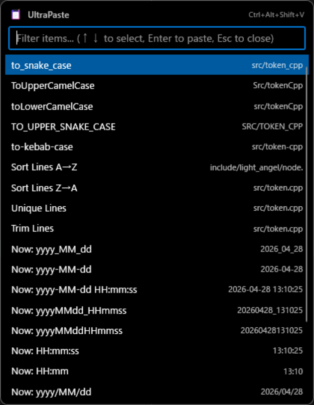

# UltraPaste

A lightweight and smart text transformation utility for Windows.

## Overview

**UltraPaste** is a productivity tool designed to streamline text formatting and insertion. Triggered by a global hotkey, it allows you to instantly modify your clipboard content or insert time-based snippets directly into any active application.

## Features

- **Clipboard Transformation**: Convert text on the fly (e.g., `snake_case`, `camelCase`, `PascalCase`, sorting, trimming).
- **Time Snippets**: Insert the current date and time in multiple formats (including Unix timestamps).
- **Global Hotkey**: Press `Ctrl + Shift + Alt + V` to summon the palette.
- **Incremental Search**: Filter commands instantly by typing.
